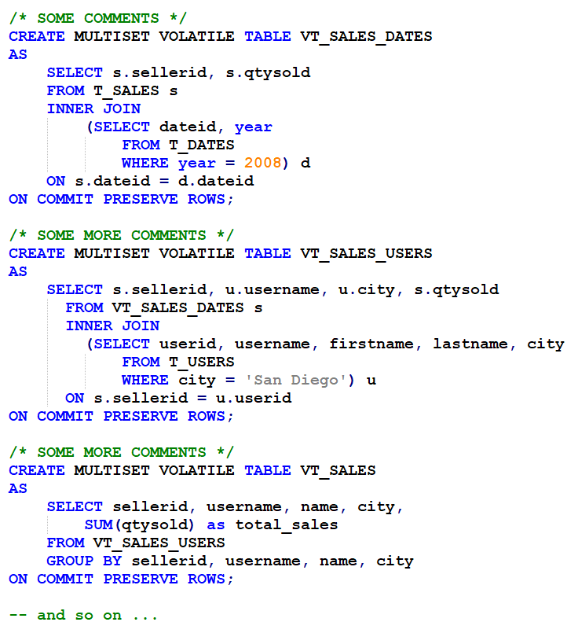

import Gist from 'react-gist';

Most traditional data warehouse or datamart ETL routines consist of multi stage SQL transformations, often a series of CTAS (`CREATE TABLE AS SELECT`) statements usually creating transient or temporary tables – such as volatile tables in Teradata or Common Table Expressions (CTE’s).

:::note Spark Training Courses

[Data Transformation and Analysis Using Apache Spark](https://academy.alphazetta.ai/data-transformation-and-analysis-using-apache-spark/)  
[Stream and Event Processing using Apache Spark](https://academy.alphazetta.ai/stream-and-event-processing-using-apache-spark/)  
[Advanced Analytics Using Apache Spark](https://academy.alphazetta.ai/advanced-analytics-using-apache-spark/)

:::


The initial challenge when moving from a SQL/MPP based ETL framework platformed on Oracle, Teradata, SQL Server, etc to a Spark based ETL framework is what to do with this…



One approach is to use the lightweight, configuration driven, multi stage Spark SQL based ETL framework described in this post.

This framework is driven from a YAML configuration document. YAML was preferred over JSON as a document format as it allows for multi-line statements (SQL statements), as well as comments - which are very useful as SQL can sometimes be undecipherable even for the person that wrote it.

The YAML config document has three main sections: __`sources`__, __`transforms`__ and __`targets`__.

### Sources

The __`sources`__ section is used to configure the input data source(s) including optional column and row filters. In this case the data sources are tables available in the Spark catalog (for instance the AWS Glue Catalog or a Hive Metastore), this could easily be extended to read from other datasources using the Spark DataFrameReader API.

<Gist id="eaf03229466718ee125e0a6d23370f1b" 
/>

### Transforms

The __`transforms`__ section contains the multiple SQL statements to be run in sequence where each statement creates a temporary view using objects created by preceding statements.

<Gist id="89ad7ac6b036e5f22b2d3dec43b1fe44" 
/>

### Targets

Finally the __`targets`__ section writes out the final object or objects to a specified destination (S3, HDFS, etc).

<Gist id="5af780dd6b6e5ddd79a4cac8a59e6a69" 
/>

### Process SQL Statements

The __`process_sql_statements.py`__ script that is used to execute the framework is very simple (30 lines of code not including comments, etc). It loads the sources into Spark Dataframes and then creates temporary views to reference these datasets in the __`transforms`__ section, then sequentially executes the SQL statements in the list of transforms. Lastly the script writes out the final view or views to the desired destination – in this case parquet files stored in S3 were used as the target.

You could implement an object naming convention such as prefixing object names with `sv_`, `iv_`, `fv_` (for source view, intermediate view and final view respectively) if this helps you differentiate between the different objects.

To use this framework you would simply use __`spark-submit`__ as follows:

```
spark-submit process_sql_statements.py config.yml
```

> *Full source code can be found at: [__https://github.com/avensolutions/spark-sql-etl-framework__](https://github.com/avensolutions/spark-sql-etl-framework)*
