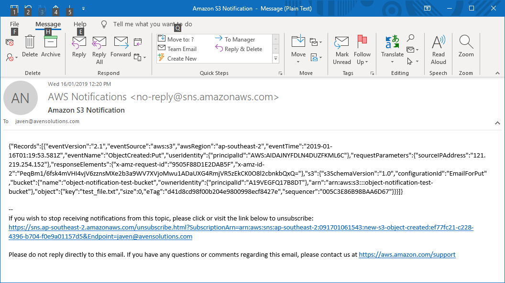
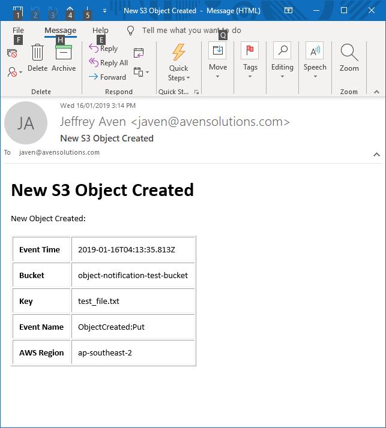
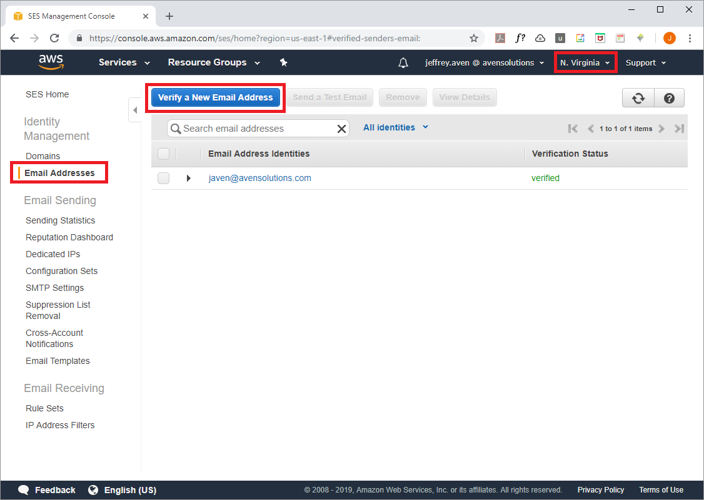

import Gist from 'react-gist';


Following on from the previous post in the Really Simple Terraform series [simple-lambda-ec2-scheduler](https://cloudywithachanceofbigdata.com/really-simple-terraform-infrastructure-automation-using-aws-lambda/), where we used Terraform to deploy a Lambda function including the packaging of the Python function into a ZIP archive and creation of all supporting objects (roles, policies, permissions, etc) – in this post we will take things a step further by using templating to update parameters in the Lambda function code before the packaging and creation of the Lambda function.

S3 event notifications can be published directly to an SNS topic which you could create an email subscription, this is quite straightforward. However the email notifications you get look something like this:



There is very little you can do about this.

However if you take a slightly different approach by triggering a Lambda function to send an email via SES you have much more control over content and formatting. Using this approach you could get an email notification that looks like this:



Much easier on the eye!

## Prerequisites

You will need verified AWS SES (Simple Email Service) email addresses for the sender and recipient’s addresses used for your object notification emails. This can be done via the console as shown here:



_Note that SES is not available in every AWS region, pick one that is generally closest to your particular reason (but it really doesn't matter for this purpose)._

## Deployment

The Terraform module creates an IAM Role and associated policy for the Lambda function as shown here:

<Gist id="023fab404c0df759d6d1d4bdb02ab4e8" 
/>

Variables in the module are substituted into the function code template, the rendered template file is then packaged as a ZIP archive to be uploaded as the Lambda function source as shown here:

<Gist id="7d72d8c67114a9df0af1528a3b754d9e" 
/>

_As in the previous post, I will reiterate that although Terraform is technically not a build tool, it can be used for simple build operations such as this._

The Lambda function is deployed using the following code:

<Gist id="5e7f2a238e8e0270cd55def40a389903" 
/>

Finally the S3 object notification events are configured as shown here:

<Gist id="e7de65f20c79e0efb115024597864a75" 
/>

Use the following commands to run this example (I have created a default credentials profile, but you could supply your API credentials directly, use STS, etc):

```
cd simple-notifications-with-lambda-and-ses
terraform init
terraform apply
```

> *Full source code can be found at: [__https://github.com/avensolutions/simple-notifications-with-lambda-and-ses__](https://github.com/avensolutions/simple-notifications-with-lambda-and-ses)*