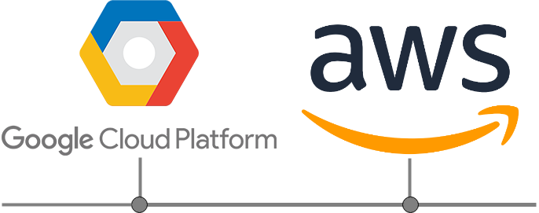
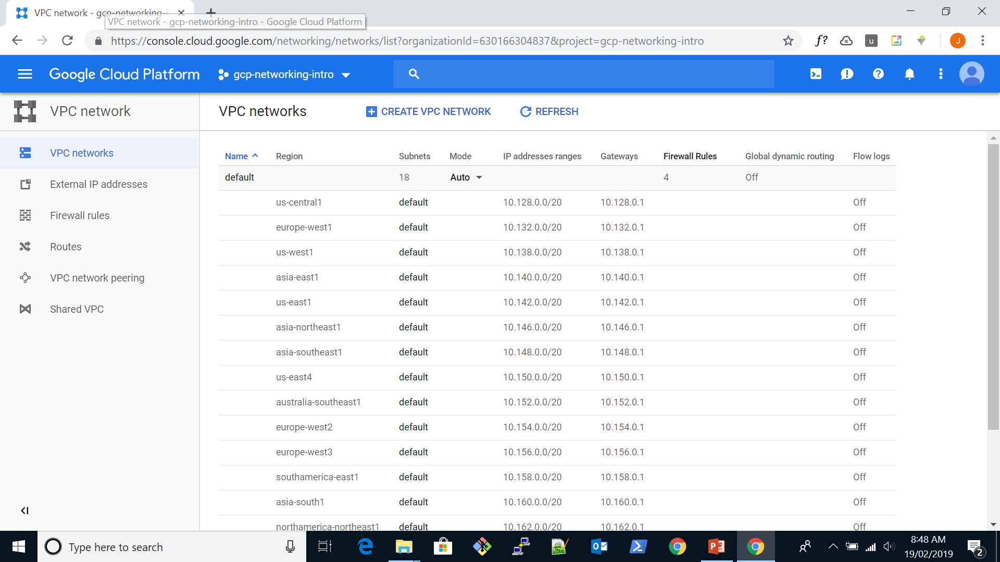

GCP and AWS share many similarities, they both provide similar services and both leverage containerization, virtualization and software defined networking.

There are some significant differences when it comes to their respective implementations, networking is a key example of this.

Before we compare and contrast the two different approaches to networking, it is worthwhile noting the genesis of the two major cloud providers.

#### _Google was born to be global, Amazon became global_

By no means am I suggesting that Amazon didn't have designs on going global from it's beginnings, but AWS was driven (entirely at the beginning) by the needs of the Amazon eCommerce business. Amazon started in the US before expanding into other regions (such as Europe and Australia). In some cases the expansion took decades (Amazon only entered Australia as a retailer in 2018).

Google, by contrast, was providing application, search and marketing services worldwide from its very beginning. GCP which was used as the vector to deliver these services and applications was architected around this global model, even though their actual data centre expansion may not have been as rapid as AWS’s (for example GCP opened its Australia region 5 years after AWS).

Their respective networking implementations reflect how their respective companies evolved.

#### _AWS is a leader in IaaS, GCP is a leader in PaaS_

This is only an opinion and may be argued, however if you look at the chronology of the two platforms, consider this:

- The first services released by AWS (simultaneously for all intents and purposes) were S3, SQS and EC2
- The first service released by Google was AppEngine (a pure PaaS offering)

Google has launched and matured their IaaS offerings since as AWS has done similarly with their PaaS offerings, but they started from much different places.

With all of that said, here are the key differences when it comes to networking between the two major cloud providers:

### GCP VPCs are Global by default, AWS VPCs are Regional only

This is the first fundamental difference between the two providers. Each GCP project is allocated one VPC network with Subnets in each of the 18 GCP Regions. Whereas each AWS Account is allocated one Default VPC in each AWS Region with a Subnet in each AWS Availability Zone for that Region, that is each account has 17 VPCs in each of the 17 Regions (excluding GovCloud regions).

It is entirely possible to create VPCs in GCP which are Regional, but they are Global by default.

This global tenancy can be advantageous in many cases, but can be limiting in others, for instance there is a limit of 25 peering connections to any one VPC, the limit in AWS is 125.

### GCP Subnets are Regional, AWS Subnets are Zonal

Subnets in GCP automatically span all Zones in a Region, whereas AWS VPC Subnets are assigned to Availability Zones in a Region. This means you are abstracted from some of the networking and zonal complexity, but you have less control over specific network placement of instances and endpoints. You can infer from this design that Zones are replicated or synchronised within a Region, making them less of a direct consideration for High Availability (or at least as much or your concern as they otherwise would be).

### All GCP Firewall Rules are Stateful

AWS Security Groups are stateful firewall rules – meaning they maintain connection state for inbound connections, AWS also has Network ACLs (NACLs) which are stateless firewall rules. GCP has no direct equivalent of NACLs, however GCP Firewall Rules are more configurable than their AWS counterparts. For instance, GCP Firewall Rules can include Deny actions which is not an option with AWS Security Group Rules.

### Load Balancers in GCP are layer 4 (TCP/UDP) unless they are public facing

AWS Application Load Balancers can be deployed in private VPCs with no external IPs attached to them. GCP has Application Load Balancers (Layer 7 load balancers) but only for public facing applications, internal facing load balancers in GCP are Network Load Balancers. This presents some challenges with application level load balancing functionality such as stickiness. There are potential workarounds however such as NGINX in GKE behind

### Firewall rules are at the Network Level not at the Instance or Service Level

There are simple firewall settings available at the instance level, these are limited to allowing HTTP and HTTPS traffic to the instance only and don’t allow you to specify sources. Detailed Firewall Rules are set at the GCP VPC Network level and are not attached or associated with instances as they are in AWS.

_Hopefully this is helpful for AWS engineers and architects being exposed to GCP for the first time!_
