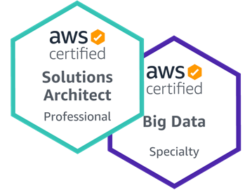

One you get beyond the Associate level AWS certification exams into the Professional or Speciality track exams the degree of difficulty rises significantly. As a veteran of the Certified Solutions Architect Professional and Big Data Specialty exams, I thought I would share my experiences which I believe are applicable to all the certification streams and tracks in the AWS certification program.

First off let me say that I am a self-professed certification addict, having sat more than thirty technical certification exams over my thirty plus year career in technology including certification and re-certification exams. I would put the AWS professional and specialty exams right up there in terms of their level of difficulty.

The AWS Professional and Specialty exams are specifically designed to be challenging. Although they have removed the pre-requisites for these exams (much to my dismay…), you really need to be prepared for these exams otherwise you are throwing your hard-earned money away.  

There are very few - if any - “easy” questions. All of the questions are scenario based and require you to design a solution to meet multiple requirements. The question and/or the correct answer will invariably involve the use of multiple AWS services (not just one). You will be tested on your reading comprehension, time management and ability to cope under pressure as well as being tested on your knowledge of the AWS platform.  

The following sections provide some general tips which will help you approach the exam and give you the best chance of success on the day. This is not a brain dump or a substitute for the hard work and dedication required to ensure success on your exam day.

## Time Management

Needless to say, your ability to manage time is critical, on average you will have approximately 2-3 minutes to answer each question. Reading the questions and answers carefully may take up 1-2 minutes on its own. If the answer is not apparent to you, you are best to mark the question and come back to it at the end of the exam.  

In many cases there may be subsequent questions and answer sets which jog your memory or help you deduce the correct answers to the questions you initial passed on. For instance, you may see references in future questions which put context around services you may not be completely familiar with, this may enable you to answer flagged questions with more confidence.  

Of course, you must answer all questions before completing the exam, there are no points for incomplete or unattempted answers.

## Recommended Approach to each Question

Most of the questions on the Professional or Specialty certification exams fall into one of three categories:

- Short-ish question, multiple long detailed answer options
- Long-ish scenario question, multiple relatively short answer options
- Long-ish question with multiple relatively long, detailed answers

The latter scenario is thankfully less common. However, in all cases it is important to read the last sentence in the question first, this will provide indicators to help you read through the question in its entirety and all of the possible answers with a clear understanding of what is _“really”_ being asked. For instance, the operative phrase may be _“highly available”_ or _“most cost effective”_.

Try to eliminate answers based on what you know, for instance answers with erroneous instance families can be eliminated immediately. This will give you a much better statistical chance of success, even if you have to venture an educated guess in the end.

## The Most Complicated Solution is Probably Not the Correct One

In many answer sets to questions on the Professional or Specialty exams you will see some ridiculously complicated solution approaches, these are most often incorrect answers. Although there may be enough loosely relevant terminology or services to appear reasonable.

Note the following statement direct from the AWS Certified Solutions Architect Professional Exam Blueprint:

>   
> “Distractors, or incorrect answers, are response options that an examinee with incomplete knowledge or skill would likely choose. However, they are generally plausible responses that fit in the content area defined by the test objective.”

AWS wants professionals who design and implement solutions which are simple, sustainable, highly available, scalable and cost effective. One of the key Amazon Leadership Principles is _“Invent and Simplify”_, simplify is often the operative word.

## Don’t spend time on dumps or practice exams (other than those from AWS)

The question pools for AWS exams are enormous, the chances of you getting the same questions and answer sets as someone else are slim. Furthermore, non-AWS sources may not be trustworthy. There is no substitute to AWS white papers, how to’s, and real-life application of your learnings.

## Don’t focus on Service Limits or Calculations

In my experiences with AWS exams, they are not overly concerned with service limits, default values, formulas (e.g. the formula to calculate required partitions for a DynamoDB table) or syntax - so don’t waste time remembering them. You should however understand the 7 layer OSI model and be able to read and interpret CIDR notation.

Mainly, however, they want you to understand how services work together in an AWS solution to achieve an outcome for a customer.

## Some Final Words of Advice

**Always do what you think AWS would want you to do!** 

It is worthwhile having a quick look at the [AWS Leadership Principles](https://blog.aboutamazon.com.au/amazon-in-australia/our-leadership-principles) (I have already referenced one of these in this article) as these are applied religiously in every aspect of the AWS business.  In particular, you should pay specific attention to the principals around simplicity and frugality.

**Good luck!**

> if you have enjoyed this post, please consider [__buying me a coffee ☕__](https://www.buymeacoffee.com/jeffreyaven) to help me keep writing!
