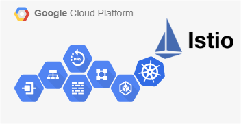

At the time of this writing, GCP does not have a generally available non-public facing Layer 7 load balancer. While this is sure to change in the future, this article outlines a design pattern which has been proven to provide scalable and extensible application load balancing services for multiple applications running in Kubernetes pods on GKE.

When you create a service of type LoadBalancer in GKE, Kubernetes hooks into the provider (GCP in this case) on your behalf to create a Google Load Balancer, while this may be specified as INTERNAL, there are two issues:

### Issue #1:

The GCP load balancer created for you is a Layer 4 TCP load balancer.

### Issue #2:

The normal behaviour is for Google to enumerate all of the node pools in your GKE cluster and “automagically” create mapping GCE instance groups for each node pool for each zone the instances are deployed in. This means the entire surface area of your cluster is exposed to the external network – which may not be optimal for internal applications on a multi tenanted cluster.

### The Solution:

Using [Istio](https://istio.io/) deployed on GKE along with the [Istio Ingress Gateway](https://istio.io/docs/concepts/traffic-management/#ingress-and-egress) along with an externally created load balancer, it is possible to get scalable HTTP load balancing along with all the normal ALB goodness (stickiness, path-based routing, host-based routing, health checks, TLS offload, etc.).

An abstract depiction of this architecture is shown here:

This can be deployed with a combination of [Terraform](https://www.terraform.io/) and kubectl. The steps to deploy at a high level are:

1. Create a GKE cluster with at least two node pools: ingress-nodepool and service-nodepool. Ideally create these node pools as multi-zonal for availability. You could create additional node pools for your Egress Gateway or an operations-nodepool to host Istio, etc as well.
2. Deploy Istio.
3. Deploy the Istio Ingress Gateway service on the ingress-nodepool using Service type NodePort.
4. Create an associated Certificate Gateway using server certificates and private keys for TLS offload.
5. Create a service in the service-nodepool.
6. Reserve an unallocated static IP address from the node network range.
7. [Create an internal TCP load balancer](https://cloud.google.com/load-balancing/docs/internal/setting-up-internal):
    1. Specify the frontend as the IP address reserved in step 6.
    2. Specify the backend as the managed instance groups created during the node pool creation for the ingress-nodepool (ingress-nodepool-ig-a, ingress-nodepool-ig-b, ingress-nodepool-ig-c).
    3. Specify ports 80 and 443.
8. Create a GCP Firewall Rule to allow traffic from authorized sources (network tags or CIDR ranges) to a target of the ingress-nodepool network tag.
9. Create a Cloud DNS A Record for your managed zone as \*.namespace.zone pointing to the IP Address assigned to the load balancer frontend in step 7.1.
10. [Enable Health Checks through the GCP firewall](https://cloud.google.com/load-balancing/docs/health-checks#firewall_rules) to reach the ingress-nodepool network tag at a minimum – however there is no harm in allowing these to all node pools.

The service should then be resolvable and routable from authorized internal networks (peered private VPCs or internal networks connected via VPN or Dedicated Interconnect) as:

> https://_service__.__namespace__.__zone__/__endpoint__

### The advantages of this design pattern are...

1. The Ingress Gateway provides fully functional application load balancing services.
2. Istio provides service discovery and routing using names and namespaces.
3. The Ingress Gateway service and ingress gateway node pool can be scaled as required to meet demand.
4. The Ingress Gateway is multi zonal for greater availability
