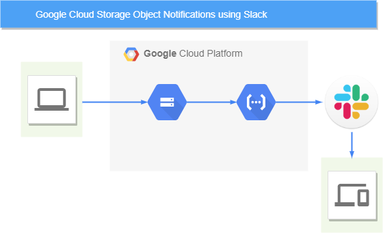

import Gist from 'react-gist';
import ImageWithCaption from '/js/ImageWithCaption/ImageWithCaption.js';
import SetupImage1 from './images/slack-notifications-setup-1.png';
import SetupImage2 from './images/slack-notifications-setup-2.png';
import SetupImage3 from './images/slack-notifications-setup-3.png';
import SetupImage4 from './images/slack-notifications-setup-4.png';
import SetupImage5 from './images/slack-notifications-setup-5.png';
import SetupImage6 from './images/slack-notifications-setup-6.png';
import SetupImage7 from './images/output-onlinepngtools.png';
import SetupImage8 from './images/slack-notification.png';

This article describes the steps to integrate Slack with Google Cloud Functions to get notified about object events within a specified Google Cloud Storage bucket.

[](images/Slack-GCS.png)

Events could include the creation of new objects, as well as delete, archive or metadata operations performed on a given bucket.

This pattern could be easily extended to other event sources supported by Cloud Functions including:

- Cloud Pub/Sub messages
- Cloud Firestore and Firebase events
- Stackdriver log entries

More information can be found at [https://cloud.google.com/functions/docs/concepts/events-triggers](https://cloud.google.com/functions/docs/concepts/events-triggers).

The prerequisite steps to configure Slack are provided here:

1. First you will need to create a Slack app (assuming you have already set up an account and a workspace). The following screenshots demonstrate this process:

<ImageWithCaption 
imageSrc={SetupImage1}
altText="Create a Slack app"
/>

<ImageWithCaption 
imageSrc={SetupImage2}
altText="Give the app a name and associate it with an existing Slack workspace"
/>

2. Next you need to Enable and Activate Incoming Webhooks to your app and add this to your workspace. The following screenshots demonstrate this process:

<ImageWithCaption 
imageSrc={SetupImage3}
altText="Enable Incoming Web Hooks for the app"
/>

<ImageWithCaption 
imageSrc={SetupImage4}
altText="Activate incoming webhooks"
/>

<ImageWithCaption 
imageSrc={SetupImage5}
altText="Add the webhook to your workspace"
/>

3. Next you need to specify a channel for notifications generated from object events.

<ImageWithCaption 
imageSrc={SetupImage6}
altText="Select a channel for the webhook"
/>

4. Now you need to copy the Webhook url provided, you will use this later in your Cloud Function.

<ImageWithCaption 
imageSrc={SetupImage7}
altText="Copy the webhook URL to the clipboard"
/>

> Treat your webhook url as a secret, do not upload this to a public source code repository

Next you need to create your Cloud Function, this example uses Python but you can use an alternative runtime including Node.js or Go.

This example templates the source code using the Terraform `template_file` data source. The function source code is shown here:

<Gist id="e248abd1af393e58de84e8776161c8cb" 
/>

Within your Terraform code you need to render your Cloud Function code substituting the `slack_webhook_url` for it's value which you will supply as a Terraform variable. The rendered template file is then placed in a local directory along with a `requirements.txt` file and zipped up. The resulting Zip archive is uploaded to a specified bucket where it will be sourced to create the Cloud Function.

<Gist id="e247d09d33a4aca9154de081f3063978" 
/>

Now you need to create the Cloud Function, the following HCL snippet demonstrates this:

<Gist id="87e2e83e5b2b800d685a8d239280ca13" 
/>

The `event_trigger` block in particular specifies which GCS bucket to watch and what events will trigger invocation of the function. Bucket events include:

- `google.storage.object.finalize` _(the creation of a new object)_
- `google.storage.object.delete`
- `google.storage.object.archive`
- `google.storage.object.metadataUpdate`

You could add additional logic to the Cloud Function code to look for specific object names or naming patterns, but keep in mind the function will fire upon every event matching the `event_type` and `resource` criteria.

To deploy the function, you would simply run:

```
terraform apply -var="slack_webhook_url=https://hooks.slack.com/services/XXXXXXXXX/XXXXXXXXX/XXXXXXXXXXXXXXXXXXXXXXXX"
```

Now once you upload a file named `test-object.txt`, voilà!:

<ImageWithCaption 
imageSrc={SetupImage8}
altText="Slack notification for a new object created"
/>

> Full source code is available at: [https://github.com/gamma-data/gcs-object-notifications-using-slack](https://github.com/gamma-data/gcs-object-notifications-using-slack)

> if you have enjoyed this post, please consider [__buying me a coffee ☕__](https://www.buymeacoffee.com/jeffreyaven) to help me keep writing!