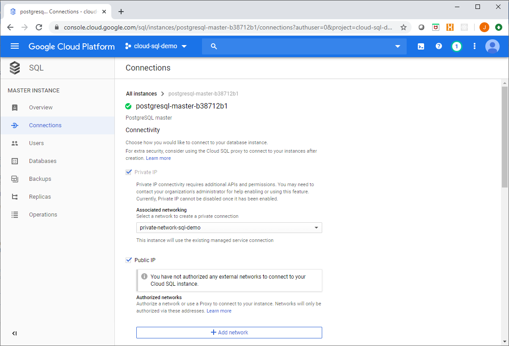
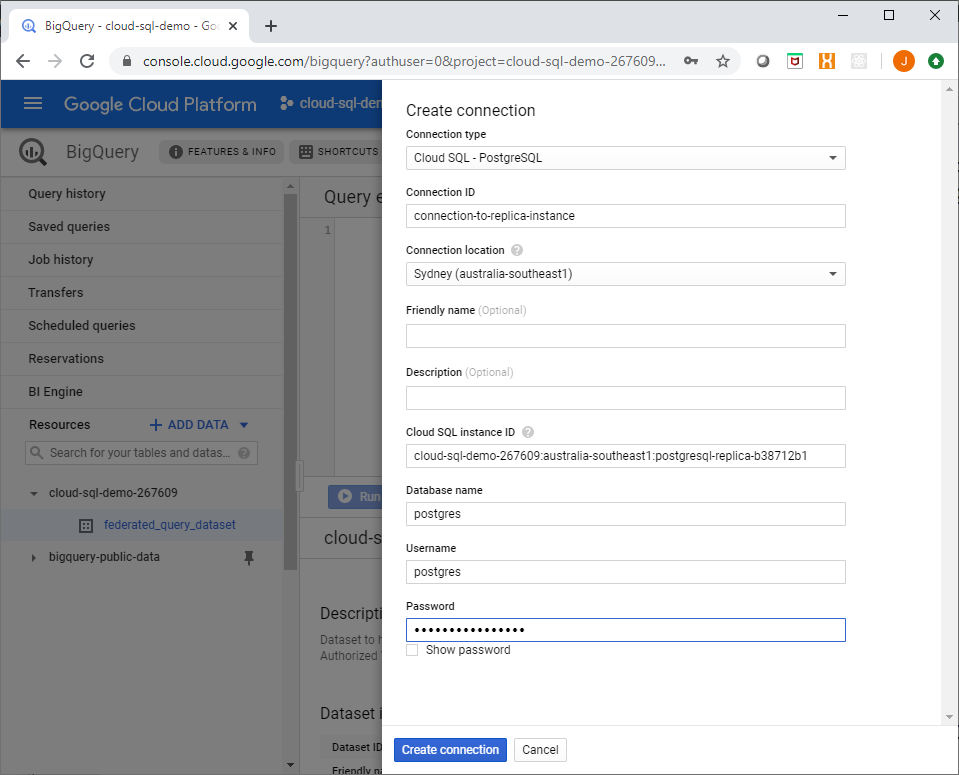
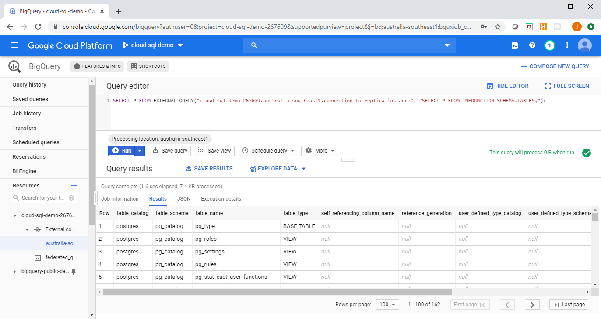

import Gist from 'react-gist';

This article demonstrates Cloud SQL federated queries for Big Query, a neat and simple to use feature.

## Connecting to Cloud SQL

One of the challenges presented when using Cloud SQL on a private network (VPC) is providing access to users. There are several ways to accomplish this which include:

- open the database port on the VPC Firewall (5432 for example for Postgres) and let users access the database using a command line or locally installed GUI tool _(may not be allowed in your environment)_
- provide a web based interface deployed on your VPC such as PGAdmin deployed on a GCE instance or GKE pod _(adds security and management overhead)_
- use the Cloud SQL proxy _(requires additional software to be installed and configured)_

In additional, all of the above solutions require direct IP connectivity to the instance which may not always be available. Furthermore each of these operations requires the user to present some form of authentication – in many cases the database user and password which then must be managed at an individual level.

Enter Cloud SQL federated queries for Big Query…

## Big Query Federated Queries for Cloud SQL

Big Query allows you to query tables and views in Cloud SQL (currently MySQL and Postgres) using the Federated Queries feature. The queries could be authorized views in Big Query datasets for example.

This has the following advantages:

- Allows users to authenticate and use the GCP console to query Cloud SQL
- Does not require direct IP connectivity to the user or additional routes or firewall rules
- Leverages Cloud IAM as the authorization mechanism – rather that unmanaged db user accounts and object level permissions
- External queries can be executed against a read replica of the Cloud SQL instance to offload query IO from the master instance

## Setting it up

Setting up big query federated queries for Cloud SQL is exceptionally straightforward, a summary of the steps are provided below:

### Step 1. Enable a Public IP on the Cloud SQL instance

This sounds bad, but it isn’t really that bad. You need to enable a public interface for Big Query to be able to establish a connection to Cloud SQL, however this is not accessed through the actual public internet – rather it is accessed through the Google network using the back end of the front end if you will.

Furthermore, you configure an empty list of authorized networks which effectively shields the instance from the public network, this can be configured in Terraform as shown here:

<Gist id="81c57a80a7e588b98ea7d294dbaee242" 
/>

This configuration change can be made to a running instance as well as during the initial provisioning of the instance.

As shown below you will get a warning dialog in the console saying that you have no authorized networks - this is by design.

[](images/cloud-sql-publicip-screenshot.png)

### Step 2. Create a Big Query dataset which will be used to execute the queries to Cloud SQL

Connections to Cloud SQL are defined in a Big Query dataset, this can also be use to control access to Cloud SQL using authorized views controlled by IAM roles.

<Gist id="8a4beaab134a1c72613347b5822d1724" 
/>

### Step 3. Create a connection to Cloud SQL

To create a connection to Cloud SQL from Big Query you must first enable the BigQuery Connection API, this is done at a project level.

As this is a fairly recent feature there isn't great coverage with either the **`bq`** tool or any of the Big Query client libraries to do this so we will need to use the console for now...

Under the _**Resources**_ -> **_Add Data_** link in the left hand panel of the Big Query console UI, select **_Create Connection_**. You will see a side info panel with a form to enter connection details for your Cloud SQL instance.

In this example I will setup a connection to a Cloud SQL read replica instance I have created:

[](images/big-query-add-connection.png)

Creating a Big Query Connection to Cloud SQL

More information on the Big Query Connections API can be found at: [https://cloud.google.com/bigquery/docs/reference/bigqueryconnection/rest](https://cloud.google.com/bigquery/docs/reference/bigqueryconnection/rest)

The following permissions are associated with connections in Big Query:

```
bigquery.connections.create  
bigquery.connections.get  
bigquery.connections.list  
bigquery.connections.use  
bigquery.connections.update  
bigquery.connections.delete
```

These permissions are conveniently combined into the following predefined roles:

```
roles/bigquery.connectionAdmin    (BigQuery Connection Admin)         
roles/bigquery.connectionUser     (BigQuery Connection User)          
```

### Step 4. Query away!

Now the connection to Cloud SQL can be accessed using the **`EXTERNAL_QUERY`** function in Big Query, as shown here:

[](images/cloud-sql-federated-queries-screenshot.png)
