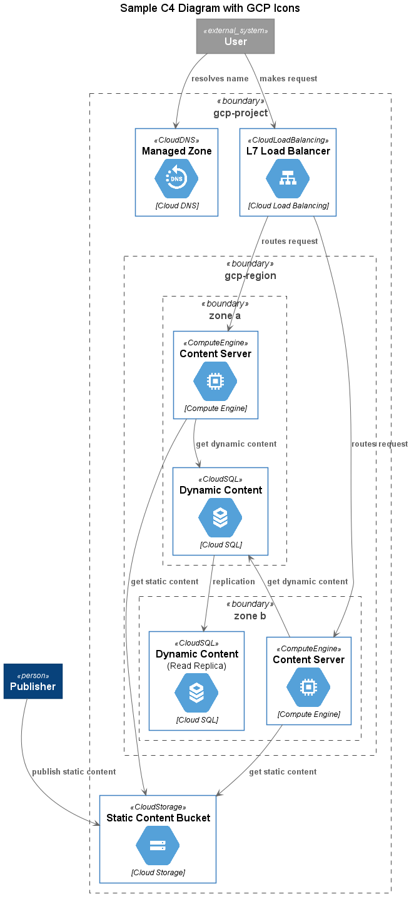

I am a believer in the mantra of _**“Everything-as-Code”**_, this includes diagrams and other architectural artefacts. Enter PlantUML…

## PlantUML

[PlantUML](https://plantuml.com/) is an open-source tool which allows users to create UML diagrams from an intuitive DSL (Domain Specific Language). PlantUML is built on top of Graphviz and enables software architects and designers to use code to create Sequence Diagrams, Use Case Diagrams, Class Diagrams, State and Activity Diagrams and much more.

## C4 Diagrams

PlantUML can be extended to support the [C4 model](https://c4model.com/) for visualising software architecture. Which describes software in different layers including Context, Container, Component and Code diagrams.

## GCP Architecture Diagramming using C4

PlantUML and C4 can be used to produce cloud architectures, there are official libraries available through PlantUML for Azure and AWS service icons, however these do not exist for GCP yet. There are several open source libraries available, however I have made an attempt to simplify the implementation.

The code below can be used to generate a C4 diagram describing a GCP architecture including official GCP service icons:

```
@startuml
!define GCPPuml https://raw.githubusercontent.com/gamma-data/GCP-C4-PlantUML/master/templates

!includeurl GCPPuml/C4\_Context.puml
!includeurl GCPPuml/C4\_Component.puml
!includeurl GCPPuml/C4\_Container.puml
!includeurl GCPPuml/GCPC4Integration.puml
!includeurl GCPPuml/GCPCommon.puml

!includeurl GCPPuml/Networking/CloudDNS.puml
!includeurl GCPPuml/Networking/CloudLoadBalancing.puml
!includeurl GCPPuml/Compute/ComputeEngine.puml
!includeurl GCPPuml/Storage/CloudStorage.puml
!includeurl GCPPuml/Databases/CloudSQL.puml

title Sample C4 Diagram with GCP Icons

Person(publisher, "Publisher")
System\_Ext(device, "User")

Boundary(gcp,"gcp-project") {
  CloudDNS(dns, "Managed Zone", "Cloud DNS")
  CloudLoadBalancing(lb, "L7 Load Balancer", "Cloud Load Balancing")
  CloudStorage(bucket, "Static Content Bucket", "Cloud Storage")
  Boundary(region, "gcp-region") {
    Boundary(zonea, "zone a") {
      ComputeEngine(gcea, "Content Server", "Compute Engine")
      CloudSQL(csqla, "Dynamic Content", "Cloud SQL")
    }
    Boundary(zoneb, "zone b") {
      ComputeEngine(gceb, "Content Server", "Compute Engine")
      CloudSQL(csqlb, "Dynamic Content\\n(Read Replica)", "Cloud SQL")
    }
  }
}

Rel(device, dns, "resolves name")
Rel(device, lb, "makes request")
Rel(lb, gcea, "routes request")
Rel(lb, gceb, "routes request")
Rel(gcea, bucket, "get static content")
Rel(gceb, bucket, "get static content")
Rel(gcea, csqla, "get dynamic content")
Rel(gceb, csqla, "get dynamic content")
Rel(csqla, csqlb, "replication")
Rel(publisher,bucket,"publish static content")

@enduml
```

The preceding code generates the diagram below:

[](images/Sample-C4-Diagram-with-GCP-Icons.png)

Additional services can be added and used in your diagrams by adding them to your includes, such as:

```
!includeurl GCPPuml/DataAnalytics/BigQuery.puml
!includeurl GCPPuml/DataAnalytics/CloudDataflow.puml
!includeurl GCPPuml/AIandMachineLearning/AIHub.puml
!includeurl GCPPuml/AIandMachineLearning/CloudAutoML.puml
!includeurl GCPPuml/DeveloperTools/CloudBuild.puml
!includeurl GCPPuml/HybridandMultiCloud/Stackdriver.puml
!includeurl GCPPuml/InternetofThings/CloudIoTCore.puml
!includeurl GCPPuml/Migration/TransferAppliance.puml
!includeurl GCPPuml/Security/CloudIAM.puml
' and more…
```

> The complete template library is available at:
> 
> [https://github.com/gamma-data/GCP-C4-PlantUML](https://github.com/gamma-data/GCP-C4-PlantUML)
