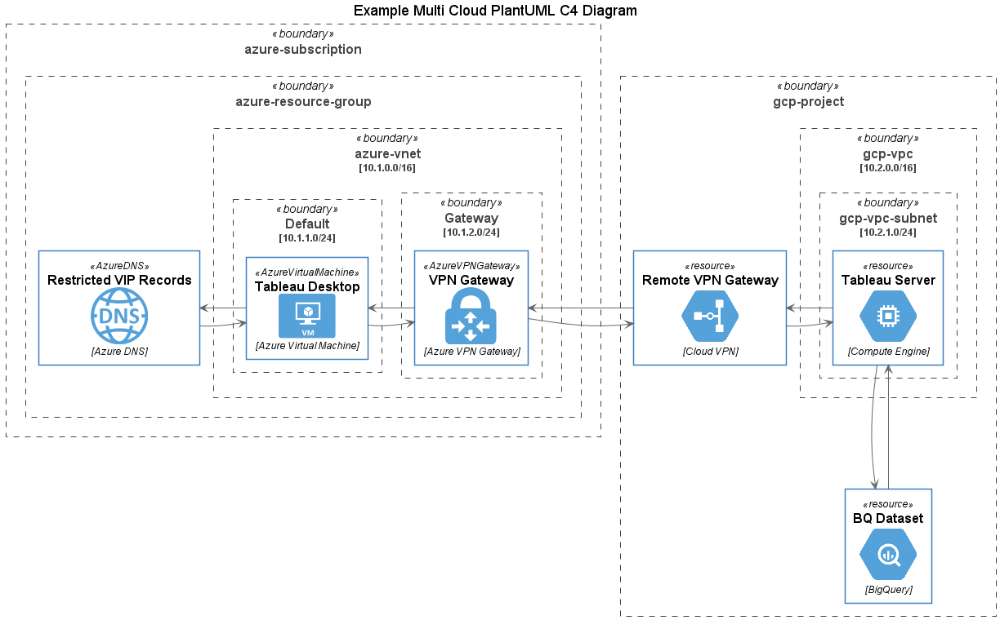

import Gist from 'react-gist';

Following on from the recent post [GCP Templates for C4 Diagrams using PlantUML](https://cloudywithachanceofbigdata.com/gcp-templates-for-c4-diagrams-using-plantuml/), cloud architects are often challenged with producing diagrams for architectures spanning multiple cloud providers, particularly as you elevate to enterprise level diagrams.

In this post, with the magic of `!includeurl` we have brought PlantUML template libraries together for AWS, Azure and GCP icon sets, allowing us to produce multi cloud C4 diagrams using PlantUML like this one:

Creating a multi cloud diagram is simple, start by adding the following `include` statements after the `@startuml` label in a new PlantUML C4 diagram:

<Gist id="5319b6b041f8b8f54c922a9a5b9b6e7c" 
/>

Then add references to the required services from different providers…

<Gist id="6ed55cd1b4e3b2e7027f8236af4aa112" 
/>

Then include the predefined resources from your different cloud providers in your diagram as shown here (describing a client server application over a cloud to cloud VPN between Azure and GCP)...

<Gist id="600aecff7094d7843771770b7048cb2c" 
/>

Happy multi-cloud diagramming!

> Full source code is available at:
> 
> [https://github.com/gamma-data/plantuml-multi-cloud-diagrams](https://github.com/gamma-data/plantuml-multi-cloud-diagrams)

> if you have enjoyed this post, please consider [__buying me a coffee ☕__](https://www.buymeacoffee.com/jeffreyaven) to help me keep writing!