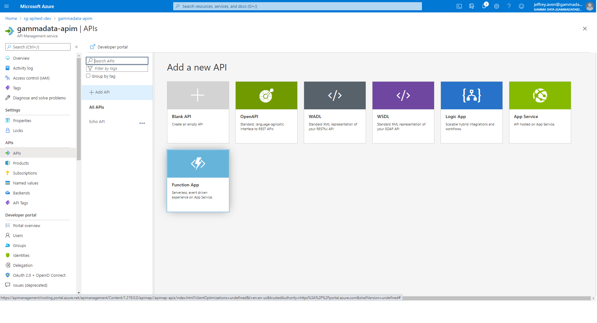
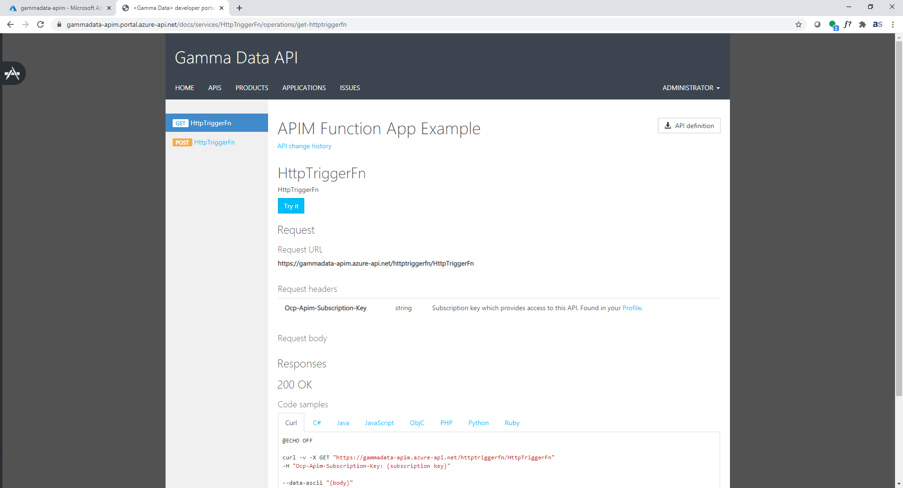

import Gist from 'react-gist';

Function Apps, Logic Apps and App Services can be used to expose APIs within Azure API Management which is an easy way to deploy serverless microservices. You can see this capability in the Azure portal below within API Management:

Like most readers, I like to script everything, so I was initially frustrated when I couldn’t replicate this operation in the Azure cli, REST, PowerShell, or any of the other SDKs or IaC tools. Others shared my frustration as seen [here](https://feedback.azure.com/forums/248703-api-management/suggestions/36832033-programmatically-import-azure-function-into-apim).

I was nearly resigned to using click ops in the portal (arrrgh) before I worked out this workaround.

## The Solution

There is a bit more prep work required to automate this process, but it is well worth it.

1. Create an OpenApi (or Swagger spec or WADL) specification document, as seen below (use the absolute URL for your Function App in the `url` parameter):

<Gist id="077e8f313e6f44393df71057c8af7850" 
/>

2. Use the `az apim api import` function (not the `az apim api create` function), as shown here:

<Gist id="1f5eec542bd5ec01dbb9a06472e8e59b" 
/>

3. Associate the API with a product (which is how you can rate limit APIs)

<Gist id="4ad9c81b97ee97fb2cb6f794c2ae820f" 
/>

That’s it! You can now access your function via the API gateway using the gateway url or via the developer portal as seen below:

> if you have enjoyed this post, please consider [__buying me a coffee ☕__](https://www.buymeacoffee.com/jeffreyaven) to help me keep writing!