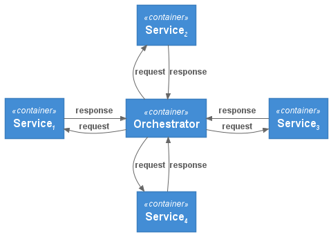

One of the foundational concepts in microservices architecture and design patterns is the concept of Orchestration versus Choreography. Before we look at a reference implementation of each of these patterns, it is worthwhile starting with an analogy.

This is often likened to a Jazz band versus a Symphony Orchestra.

A modern symphony orchestra is normally comprised of sections such as strings, brass, woodwind and percussion sections. The sections are orchestrated by a conductor, usually placed at a central point with respect to each of the sections. The conductor instructs each section to perform their components of the overall symphony.

By contrast, a Jazz band does not have a conductor and also features improvisation, with different musicians improvising based upon each other. Choreography, although more aligned to dance, can involve improvisation. In both cases there is still an intended output and a general framework as to how the composition will be executed, however unlike a symphony orchestra there is a degree of spontaneity.

_Now back to technology and microservices…_

In the Orchestration model, there is a central orchestration service which controls the interactions between other services, in other words the flow and control of communication and/or message passing between services is controlled by an orchestrator (much like the conductor in a symphony orchestra). On the plus side, this model enables easier monitoring and policy enforcement across the system. A generalisation of the Orchestration model is shown below:

By contrast, in the Choreography model, each service works independently and interacts with other services through events. In this model each service registers and emits events as they need to. The flow (of communication between services) is not predefined, much like a Jazz band. This model often includes a central broker for message passing between services, but the services operate independently of each other and are not controlled by a central service (an orchestrator). A generalisation of the Choreography model is shown below:

We will post subsequent articles with implementations of these patterns, but it is worthwhile getting a foundational understanding first.
