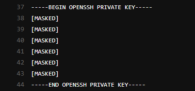

Big fan of GitLab (and GitLab CI in particular). I had a recent requirement to push changes to a wiki repo associated with a GitLab project through a GitLab CI pipeline (using the SaaS version of GitLab) and ran into a conundrum…

Using the GitLab SaaS version - deploy tokens can’t have write api access, so the next best solution is to use deploy keys, adding your public key as a deploy key and granting this key write access to repositories is relatively straightforward.

This issue is when you attempt to create a masked GitLab CI variable using the private key from your keypair, you get this…

I was a bit astonished to see this to be honest… Looks like it has been raised as an issue several times over the last few years but never resolved (the root cause of which is something to do with newline characters or base64 encoding or the overall length of the string).

I came up with a solution! Not pretty but effective, masks the variable so that it cannot be printed in CI logs as shown here:

## Setup

Add a masked and protected GitLab variable for each line in the private key, for example:

## The Code

Add the following block to your `.gitlab-ci.yml` file:

now within Jobs in your pipeline you can simply do this to clone, push or pull from a remote GitLab repo:

as mentioned not pretty, but effective and no other cleaner options as I could see…
