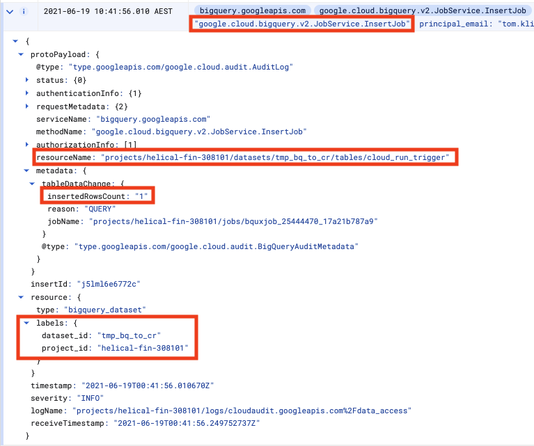

So you're using BigQuery (BQ). It's all set up and humming perfectly. Maybe now, you want to run an ELT job whenever a new table partition is created, or maybe you want to retrain your ML model whenever new rows are inserted into the BQ table.

In my previous article on [EventArc](https://cloudywithachanceofbigdata.com/eventarc-the-state-of-eventing-in-google-cloud/), we went through how Logging can help us create eventing-type functionality in your application. Let's take it a step further and walk through how we can couple BigQuery and Cloud Run.

In this article you will learn how to

- Tie together BigQuery and Cloud Run
- Use BigQuery's audit log to trigger Cloud Run
- With those triggers, run your required code

## Let's go!

Let's create a temporary dataset within BigQuery named `tmp_bq_to_cr`.

In that same dataset, let's create a table in which we will insert some rows to test our BQ audit log. Let's grab some rows from a BQ public dataset to create this table:

```sql
CREATE OR REPLACE TABLE tmp_bq_to_cr.cloud_run_trigger AS
SELECT
 date, country_name, new_persons_vaccinated, population
 from `bigquery-public-data.covid19_open_data.covid19_open_data`
 where country_name='Australia'
 AND
 date > '2021-05-31'
LIMIT 100
```

Following this, let's run an insert query that will help us build our mock database trigger:

```sql
INSERT INTO tmp_bq_to_cr.cloud_run_trigger
VALUES('2021-06-18', 'Australia', 3, 1000)
```

Now, in another browser tab let's navigate to [BQ Audit Events](https://console.cloud.google.com/logs/query;query=bigquery.v2?_ga=2.187390252.-505923201.1592376029) and look for our `INSERT INTO` event:

[](images/bq-insert-event.png)

There will be several audit logs for any given BQ action. Only after a query is parsed does BQ know which table we want to interact with, so the initial log will, for e.g., not have the table name.

We don't want any old audit log, so we need to ensure we look for a unique set of attributes that clearly identify our action, such as in the diagram above.

In the case of inserting rows, the attributes are a combination of

- The method is `google.cloud.bigquery.v2.JobService.InsertJob`
- The name of the table being inserted to is the `protoPayload.resourceName`
- The dataset id is available as `resource.labels.dataset_id`
- The number of inserted rows is `protoPayload.metadata.tableDataChanged.insertedRowsCount`

## Time for some code

Now that we've identified the payload that we're looking for, we can write the action for Cloud Run. We've picked Python and Flask to help us in this instance. ([full code is on GitHub](https://github.com/GoogleCloudPlatform/bigquery-oreilly-book/blob/master/blogs/cloud_run/main.py)).

First, let's filter out the noise and find the event we want to process

```python
@app.route('/', methods=['POST'])
def index():
    # Gets the Payload data from the Audit Log
    content = request.json
    try:
        ds = content['resource']['labels']['dataset_id']
        proj = content['resource']['labels']['project_id']
        tbl = content['protoPayload']['resourceName']
        rows = int(content['protoPayload']['metadata']
                   ['tableDataChange']['insertedRowsCount'])
        if ds == 'cloud_run_tmp' and \
           tbl.endswith('tables/cloud_run_trigger') and rows > 0:
            query = create_agg()
            return "table created", 200
    except:
        # if these fields are not in the JSON, ignore
        pass
    return "ok", 200
```

Now that we've found the event we want, let's execute the action we need. In this example, we'll aggregate and write out to a new table `created_by_trigger`:

```python
def create_agg():
    client = bigquery.Client()
    query = """
    CREATE OR REPLACE TABLE tmp_bq_to_cr.created_by_trigger AS
    SELECT
      count_name, SUM(new_persons_vaccinated) AS n
    FROM tmp_bq_to_cr.cloud_run_trigger
    """
    client.query(query)
    return query
```

The Dockerfile for the container is simply a basic Python container into which we install Flask and the BigQuery client library:

```docker
FROM python:3.9-slim
RUN pip install Flask==1.1.2 gunicorn==20.0.4 google-cloud-bigquery
ENV APP_HOME /app
WORKDIR $APP_HOME
COPY *.py ./
CMD exec gunicorn --bind :$PORT main:app
```

## Now we Cloud Run

Build the container and deploy it using a couple of gcloud commands:

```bash
SERVICE=bq-cloud-run
PROJECT=$(gcloud config get-value project)
CONTAINER="gcr.io/${PROJECT}/${SERVICE}"
gcloud builds submit --tag ${CONTAINER}
gcloud run deploy ${SERVICE} --image $CONTAINER --platform managed
```

## I always forget about the permissions

In order for the trigger to work, the Cloud Run service account will need the following permissions:

```bash
gcloud projects add-iam-policy-binding $PROJECT \
    --member="serviceAccount:service-${PROJECT_NO}@gcp-sa-pubsub.iam.gserviceaccount.com"\
    --role='roles/iam.serviceAccountTokenCreator'

gcloud projects add-iam-policy-binding $PROJECT \
    --member=serviceAccount:${SVC_ACCOUNT} \
    --role='roles/eventarc.admin'
```

### Finally, the event trigger

```bash
gcloud eventarc triggers create ${SERVICE}-trigger \
  --location ${REGION} --service-account ${SVC_ACCOUNT} \
  --destination-run-service ${SERVICE}  \
  --event-filters type=google.cloud.audit.log.v1.written \
  --event-filters methodName=google.cloud.bigquery.v2.JobService.InsertJob \
  --event-filters serviceName=bigquery.googleapis.com
```

Important to note here is that we're triggering on _any_ Insert log created by BQ That's why in this action we had to filter these events based on the payload.

# Take it for a spin

Now, try out the BigQuery -> Cloud Run trigger and action. Go to the BigQuery console and insert a row or two:

```sql
INSERT INTO tmp_bq_to_cr.cloud_run_trigger
VALUES('2021-06-18', 'Australia', 5, 25000)
```

Watch as a new table called `created_by_trigger` gets created! You have successfully triggered a Cloud Run action on a database event in BigQuery.

Enjoy!
