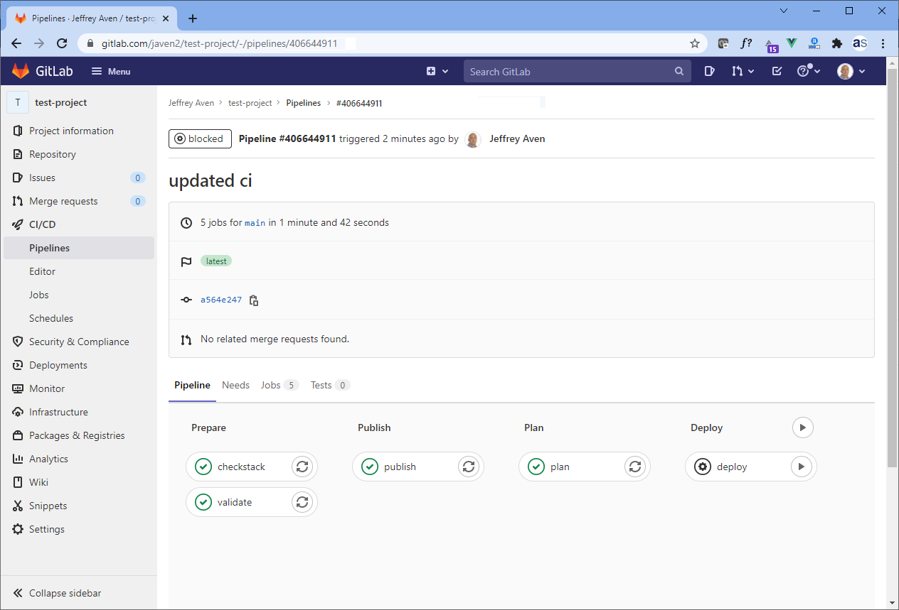
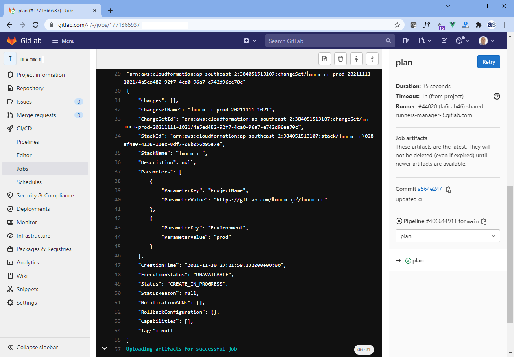

import Tabs from '@theme/Tabs';
import TabItem from '@theme/TabItem';
import Gist from 'react-gist';

Managing cloud deployments and IaC pipelines can be challenging.  I’ve put together a simple pattern for deploying stacks in AWS using CloudFormation templates using GitLab CI.  

This deployment framework enables you to target different environments based upon refs (branches or tags) for instance deploy to a dev environment for a push or merge into develop and deploy to prod on a push or merge into main, otherwise just lint/validate (e.g., for a push to a non-protected feature branch).  Templates are uploaded to a designated S3 bucket and staged for use in the pipeline and can be retained as an additional audit trail (in addition to the GitLab project history).  

Furthermore, you can review changes (by inspecting change set contents) before deploying, saving you from fat finger deployments 😊.  
 
## How it works
The logic is described here:  

<Tabs
  defaultValue="flow"
  values={[
    { label: 'Flow', value: 'flow', },
    { label: 'PlantUML', value: 'plantuml', },
  ]
}>
<TabItem value="flow">

 

</TabItem>
<TabItem value="plantuml">

```plantuml
@startuml

partition prepare {
  (*) --> === S1 ===
  === S1 === --> "Validate Template"
  --> === S2 ===
  === S1 === --> "Check Stack State"
  --> === S2 ===
}

partition publish {
  --> "Publish Template to S3"
}

partition plan {
  --> "Stack Exists?"
  --> === S3 ===
  === S3 === --> [Yes] "Create Change Set"
  === S3 === --> [No] === S4 ===
  "Create Change Set" --> === S4 ===
}

partition deploy {
  --> "MANUAL: Review Changes"
  --> "Deploy Change Set"
}

-->(*)

@enduml
```

</TabItem>
</Tabs>

The pipleline looks like this in GitLab:  

  

## Prerequisites
You will need to set up GitLab CI variables for `AWS_ACCESS_KEY_ID`, `AWS_SECRET_ACCESS_KEY` and optionally `AWS_DEFAULT_REGION`.  You can do this via __Settings -> CI/CD -> Variables__ in your GitLab project.   As `AWS_ACCESS_KEY_ID` and `AWS_SECRET_ACCESS_KEY` are secrets, they should be configured as `protected` (as they are only required for protected branches) and `masked` so they are not printed in job logs.

## `.gitlab-ci.yml` code
The GitLab CI code is shown here:  

<Gist id="d561e9f002048b4e4be4043cf185d1bd" 
/>

## Reviewing change sets (plans) and applying
Once a pipeline is triggered for an existing stack it will run hands off until a change set (plan) is created.  You can inspect the plan by clicking on the Plan GitLab CI job where you would see output like this:  

  

If you are OK with the changes proposed, you can simply hit the play button on the last stage of the pipeline (Deploy).  Voilà, stack deployed, enjoy!