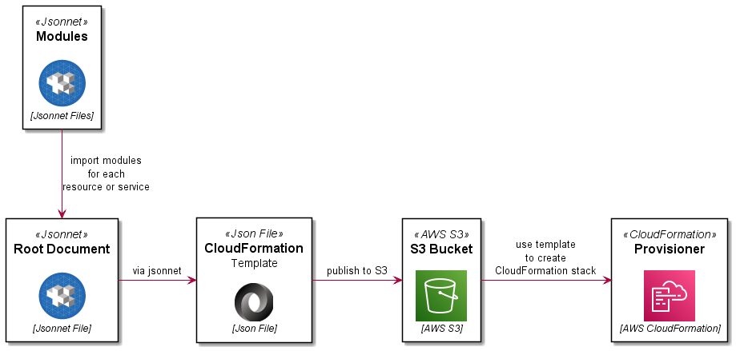

import Gist from 'react-gist';

CloudFormation templates in large environments can grow beyond a manageable point.  This article provides one approach to breaking up CloudFormation templates into modules which can be imported and used to create a larger template to deploy a complex AWS stack – using Jsonnet.  

Jsonnet is a json pre-processing and templating library which includes features including user defined and built-in functions, objects, and inheritance amongst others.  If you are not familiar with Jsonnet, here are some good resources to start with:  

- [Jsonnet](https://jsonnet.org/)
- [Blog Article: Using Jsonnet to Configure Multiple Environments](https://cloudywithachanceofbigdata.com/using-jsonnet-to-configure-multiple-environments)
- [Blog Article: Using the Jsonnet Map Function](https://docs.infraql.io/blog/using-the-jsonnet-map-function)

## Advantages

Using Jsonnet you can use imports to break up large stacks into smaller files scoped for each resource.  This approach makes CloudFormation template easier to read and write and allows you to apply the DRY (Do Not Repeat Yourself) coding principle (not possible with native CloudFormation templates.  

Additionally, although as the template fragments are in Jsonnet format, you can add annotations or comments to your code similar to YAML (not possible with a JSON template alone), although the rendered template is in legal CloudFormation Json format.  

## Process Overview

The process is summarised here: 

[](images/cloudformation-jsonnet.png) 

## Code

This example will deploy a stack with a VPC and an S3 bucket with logging.  The project directory structure would look like this:  

```bash
templates/
├─ includes/
│  ├─ vpc.libsonnet
│  ├─ s3landingbucket.libsonnet
│  ├─ s3loggingbucket.libsonnet
│  ├─ tags.libsonnet
├─ template.jsonnet
```

Lets look at all of the constituent files:  

### `template.jsonnet`
This is the root document which will be processed by Jsonnet to render a legal CloudFormation JSON template.  It will import the other files in the includes directory.  

<Gist id="8f2cc0c464de762f73b3f81c75a13832" 
/>

### `includes/tags.libsonnet`

This code module is used to generate re-usable tags for other resources (DRY).  

<Gist id="82e21743e845355ba0ef7240f1f7327a" 
/>

### `includes/vpc.libsonnet`
This code module defines a VPC resource to be created with CloudFormation.  

<Gist id="e79189bbc1cfb8b72bd860c6381f6130" 
/>

### `includes/s3loggingbucket.libsonnet`
This code module defines an S3 bucket resource to be created in the stack which will be used for logging for other buckets.  

<Gist id="187c97deca224617b064c4028ebbbee2" 
/>

### `includes/s3landingbucket.libsonnet`
This code module defines an S3 landing bucket resource to be created in the stack.  

<Gist id="c0dc5d868809f98ef672aca738bb1e5e" 
/>

## Testing
To test the pre-processing, you will need a Jsonnet binary/executable for your environment.  You can find Docker images which include this for you, or you could build it yourself.  

Once you have a compiled binary, you can run the following to generate a rendered CloudFormation template.  

```bash
jsonnet template.jsonnet -o template.json
```
You can validate this template using the AWS CLI as shown here:  

```bash
aws cloudformation validate-template --template-body file://template.json
```
## Deployment
In a previous article, [Simplified AWS Deployments with CloudFormation and GitLab CI](https://cloudywithachanceofbigdata.com/aws-deployments-with-cloudformation-and-gitlab-ci), I demonstrated an end-to-end deployment pipeline using GitLab CI.  Jsonnet pre-processing can be added to this pipeline as an initial ‘preprocess’ stage and job.  A snippet from the `.gitlab-ci.yml` file is included here:  

<Gist id="14c4c2fdccb27884c69c31f7b3a17a99" 
/>

Enjoy!

> if you have enjoyed this post, please consider [__buying me a coffee ☕__](https://www.buymeacoffee.com/jeffreyaven) to help me keep writing!