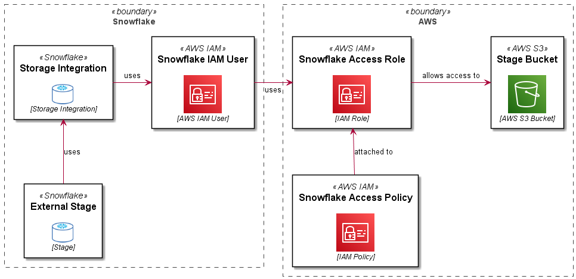

import Tabs from '@theme/Tabs';
import TabItem from '@theme/TabItem';
import Gist from 'react-gist';

I have used the instructions [here](https://docs.snowflake.com/en/user-guide/data-load-snowpipe-auto-s3.html) to configure Snowpipe for several projects.  

Although it is accurate, it is entirely click-ops oriented.  I like to automate (and script) everything, so I have created a fully automated implementation using PowerShell, the `aws` and `snowsql` CLIs.  

The challenge is that you need to go back and forth between AWS and Snowflake, exchanging information from each platform with the other.  

## Overview  

A Role Based Storage Integration in Snowflake allows a user (an AWS user arn) in your Snowflake account to use a role in your AWS account, which in turns enables access to S3 and KMS resources used by Snowflake for an external stage.  

The following diagram explains this (along with the PlantUML code used to create the diagram..):  

<Tabs
  defaultValue="overview"
  values={[
    { label: 'Overview', value: 'overview', },
    { label: 'PlantUML', value: 'plantuml', },
  ]
}>
<TabItem value="overview">

[](images/snowflake-aws-storage-integration.png) 

</TabItem>
<TabItem value="plantuml">

```plantuml
@startuml

skinparam rectangle<<boundary>> {
    Shadowing false
    StereotypeFontSize 0
    FontColor #444444
    BorderColor #444444
    BorderStyle dashed
}

skinparam defaultTextAlignment center

!$imgroot = "https://github.com/avensolutions/plantuml-cloud-image-library/raw/main/images"

!unquoted procedure $AwsIam($alias, $label, $techn, $descr="", $stereo="AWS IAM")
    rectangle "==$label\n\n<img:$imgroot/aws/SecurityIdentityCompliance/Iam.png>\n//<size:12>[$techn]</size>//" <<$stereo>> as $alias #white
!endprocedure

!unquoted procedure $AwsS3($alias, $label, $techn, $descr="", $stereo="AWS S3")
    rectangle "==$label\n\n<img:$imgroot/aws/Storage/S3.png>\n//<size:12>[$techn]</size>//" <<$stereo>> as $alias #white
!endprocedure

!unquoted procedure $Snowflake($alias, $label, $techn, $descr="", $stereo="Snowflake")
    rectangle "==$label\n\n<img:$imgroot/snowflake/snowflakeDB.png{scale=0.70}>\n//<size:12>[$techn]</size>//" <<$stereo>> as $alias #white
!endprocedure

rectangle "Snowflake" <<boundary>> {
    $AwsIam(user, Snowflake IAM User, AWS IAM User)
    $Snowflake(int, Storage Integration, Storage Integration)
    $Snowflake(stage, External Stage, Stage)
}

rectangle "AWS" <<boundary>> {
    $AwsS3(bucket, Stage Bucket, AWS S3 Bucket)
    $AwsIam(role, Snowflake Access Role, IAM Role)
    $AwsIam(policy, Snowflake Access Policy, IAM Policy)
}

stage -UP-> int : uses
int -RIGHT-> user : uses
user -RIGHT-> role : uses
policy -UP-> role : attached to
role -RIGHT-> bucket : allows access to

@enduml
```

</TabItem>
</Tabs>

## Setup  

Some prerequisites (removed for brevity):  

1.	set the following variables in your script:  
- `$accountid` – your AWS account ID
- `$bucketname` – the bucket you are letting Snowflake use as an External Stage
- `$bucketarn` – used in policy statements (you could easily derive this from the bucket name)
- `$kmskeyarn` – assuming you are used customer managed encryption keys, your Snowflake storage integration will need to use these to decrypt data in the stage
- `$prefix` – if you want to set up granular access (on a key/path basis)
2.	Configure Snowflake access credentials using environment variables or using the `~/.snowsql/config` file (you should definitely use the `SNOWSQL_PWD` env var for your password however)
3.	Configure access to AWS using `aws configure`

:::note

The actions performed in both AWS and Snowflake required privileged access on both platforms.

:::

## The Code  

I have broken this into steps, the complete code is included at the end of the article.  

### Create Policy Documents  

You will need to create the policy documents to allow the role you will create to access objects in the target S3 bucket, you will also need an initial “Assume Role” policy document which will be used to create the role and then updated with information you will get from Snowflake later.  

<Gist id="73d507126c114e6ee7398226cf004f55" 
/>

### Create Snowflake Access Policy  

Use the `snowflake_policy_doc.json` policy document created in the previous step to create a managed policy, you will need the `arn` returned in a subsequent statement.  

<Gist id="65be4f7c104f92fa3dbf9342813b3fd2" 
/>

### Create Snowflake IAM Role  

Use the initial `assume_role_policy_doc.json` created to create a new Snowflake access role, you will need the `arn` for this resource when you configure the Storage Integration in Snowflake.  

<Gist id="e1bdd5316fe7cb106de1edcff77d8e2b" 
/>

### Attach S3 Access Policy to the Role  

Now you will attach the `snowflake-access-policy` to the `snowflake-access-role` using the `$policyarn` captured from the policy creation statement.  

<Gist id="d2d54b43e379a26bd264a4c97939250c" 
/>

### Create Storage Integration in Snowflake  

Use the `snowsql` CLI to create a Storage Integration in Snowflake supplying the `$rolearn` captured from the role creation statement.  

<Gist id="8e4617227bcd68be74c2a5d694c85f91" 
/>

### Get `STORAGE_AWS_IAM_USER_ARN` and `STORAGE_AWS_EXTERNAL_ID`  

You will need the `STORAGE_AWS_IAM_USER_ARN` and `STORAGE_AWS_EXTERNAL_ID` values for the storage integration you created in the previous statement, these will be used to updated the assume role policy in your `snowflake-access-role`.  

<Gist id="14dbf570030cad1a46d88d2e87006c8e" 
/>

### Update Snowflake Access Policy  

Using the `STORAGE_AWS_IAM_USER_ARN` and `STORAGE_AWS_EXTERNAL_ID` values retrieved in the previous statements, you will update the `assume-role-policy` for the `snowflake-access-role`.  

<Gist id="944c39205e142de9a76266f7f3cd260b" 
/>

### Test the Storage Integration  

To test the connectivity between your Snowflake account and your AWS external stage using the Storage Integartion just created, create a stage as shown here:  

<Gist id="99c24e8c80c6556fe381cf64c841f739" 
/>

Now list objects in the stage (assuming there are any).  

```js
list @my_stage;
```
This should just work!  You can use your storage integration to create different stages for different paths in your External Stage bucket and use both of these objects to create Snowpipes for automated ingestion.  Enjoy!  

### Complete Code  

The complete code for this example is shown here:  

<Gist id="5f4cba25f4eac380d63f5829c56d0306" 
/>