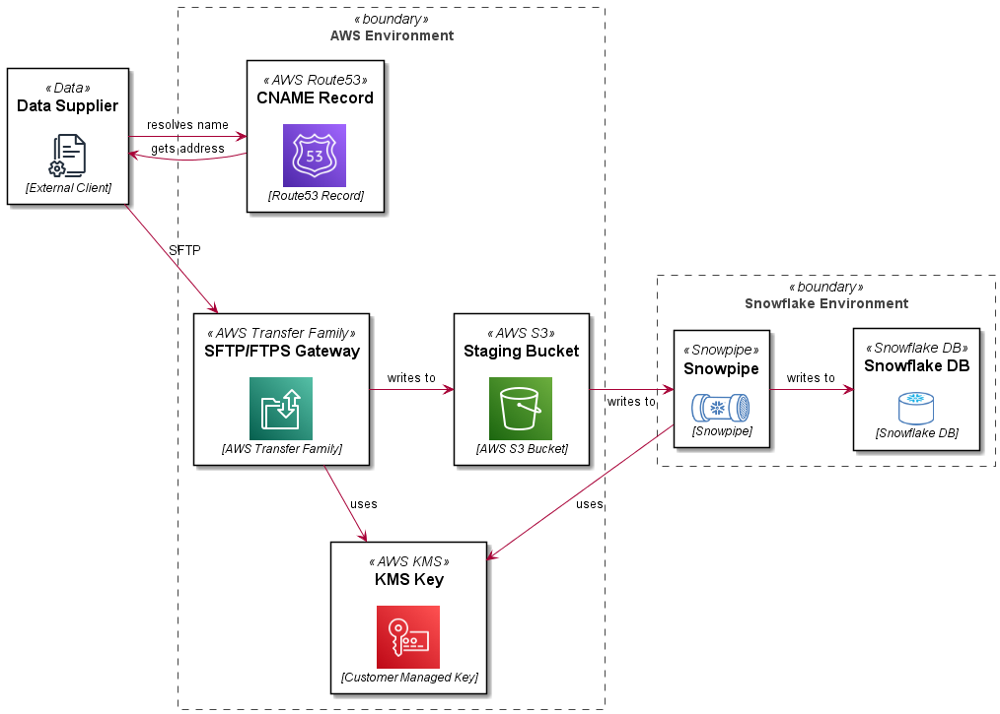

import Tabs from '@theme/Tabs';
import TabItem from '@theme/TabItem';
import Gist from 'react-gist';

> When you want the SFTP service without the SFTP Server.  

In implementing data platforms with external data providers, it is common to use a managed file transfer platform or an SFTP gateway as an entry point for providers to supply data to your system.  

Often in past implementations this would involve deploying a sever (typically a Linux VM) and provisioning and configuring an SFTP service.  If you wanted the data sent by clients to be copied to another storage medium (such as S3 or EFS) you would need to roll your own code or subscribe to a marketplace offering to do so.  

I recently trialled the [AWS Transfer Family SFTP gateway](https://docs.aws.amazon.com/transfer/index.html) offering from AWS and sharing my adventures here.  

## Architecture

In this reference architecture, we are deploying an SFTP service which uses a path in an S3 bucket as a user’s home directory.  Objects in the bucket are encrypted with a customer managed KMS key.  The SFTP server front end address is mapped to a vanity URL using Route53.  The bucket and path are integrated with a `STORAGE INTEGRATION`, `STAGE` and `PIPE` definition in Snowflake.  The Snowflake bits are covered in more detail in this blog: __[Automating Snowflake Role Based Storage Integration for AWS](automating-snowflake-role-based-storage-integration-for-aws)__.  This article just details the AWS Transfer Family SFTP setup.

<Tabs
  defaultValue="architecture"
  values={[
    { label: 'Architecture', value: 'architecture', },
    { label: 'PlantUML', value: 'plantuml', },
  ]
}>
<TabItem value="architecture">

[](images/aws-transfer-sftp-architecture.png) 

</TabItem>
<TabItem value="plantuml">

```
@startuml

skinparam rectangle<<boundary>> {
    Shadowing false
    StereotypeFontSize 0
    FontColor #444444
    BorderColor #444444
    BorderStyle dashed
}

skinparam defaultTextAlignment center

!$imgroot = "https://github.com/avensolutions/plantuml-cloud-image-library/raw/main/images"

!unquoted procedure $AwsS3($alias, $label, $techn, $descr="", $stereo="AWS S3")
    rectangle "==$label\n\n\n//<size:12>[$techn]</size>//" <<$stereo>> as $alias #white
!endprocedure

!unquoted procedure $Kms($alias, $label, $techn, $descr="", $stereo="AWS KMS")
    rectangle "==$label\n\n\n//<size:12>[$techn]</size>//" <<$stereo>> as $alias #white
!endprocedure

!unquoted procedure $Route53($alias, $label, $techn, $descr="", $stereo="AWS Route53")
    rectangle "==$label\n\n\n//<size:12>[$techn]</size>//" <<$stereo>> as $alias #white
!endprocedure

!unquoted procedure $AwsTransferFamily($alias, $label, $techn, $descr="", $stereo="AWS Transfer Family")
    rectangle "==$label\n\n\n//<size:12>[$techn]</size>//" <<$stereo>> as $alias #white
!endprocedure

!unquoted procedure $Data($alias, $label, $techn, $descr="", $stereo="Data")
    rectangle "==$label\n\n\n//<size:12>[$techn]</size>//" <<$stereo>> as $alias #white
!endprocedure

!unquoted procedure $Snowpipe($alias, $label, $techn, $descr="", $stereo="Snowpipe")
    rectangle "==$label\n\n\n//<size:12>[$techn]</size>//" <<$stereo>> as $alias #white
!endprocedure

!unquoted procedure $SnowflakeDb($alias, $label, $techn, $descr="", $stereo="Snowflake DB")
    rectangle "==$label\n\n\n//<size:12>[$techn]</size>//" <<$stereo>> as $alias #white
!endprocedure

$Data(supplier, Data Supplier, External Client)

rectangle "AWS Environment" <<boundary>> {
    $AwsTransferFamily(sftpgw, SFTP/FTPS Gateway, AWS Transfer Family)
    $AwsS3(s3staging, Staging Bucket, AWS S3 Bucket)
    $Kms(kms, KMS Key, Customer Managed Key)
    $Route53(r53, CNAME Record, Route53 Record)
}

rectangle "Snowflake Environment" <<boundary>> {
    $Snowpipe(snowpipe, Snowpipe, Snowpipe)
    $SnowflakeDb(db, Snowflake DB, Snowflake DB)
}

r53 -[hidden]D- sftpgw
supplier -> r53 : resolves name
r53 -> supplier : gets address
supplier -RIGHT-> sftpgw : SFTP
sftpgw -DOWN-> kms : uses
sftpgw -RIGHT-> s3staging: writes to
s3staging -RIGHT-> snowpipe: writes to
snowpipe -DOWN-> kms: uses
snowpipe -RIGHT-> db: writes to

@enduml
```
</TabItem>
</Tabs>

The steps to set up this pattern are detailed below.  

:::info

This example uses the Jsonnet/CloudFormation pattern described in this article: __[Simplifying Large CloudFormation Templates using Jsonnet](simplifying-large-cloudformation-templates-using-jsonnet)__.  This is a useful pattern for breaking up a monolithic CloudFormation template at design time to more manageable resource scoped documents, then pre-processing these in a CI routine (GitLab CI, GitHub Actions, etc) to create a complete template.

:::

## Setup the Service


## Create the S3 Bucket


## Create a Customer Managed KMS Key


# Create an IAM role to access the bucket

S3AccessRole

# Create a Scoped Down Policy

:::note

Something

:::

policy.txt


Couldn't read directory: Permission denied

Couldn't close file: Permission denied


# Create a Route 53 CNAME record
Cname

# Create a user

:::tip

Something

:::


User


# Create some shared Tags
Tags

# Pull it all together!
s

You would pre-process this jsonnet file in a CI job step, publish it to an S3 bucket (one dedicated for Cloud Formation templates), then deploy via Cloud Formation.  

Add more users and enjoy!  