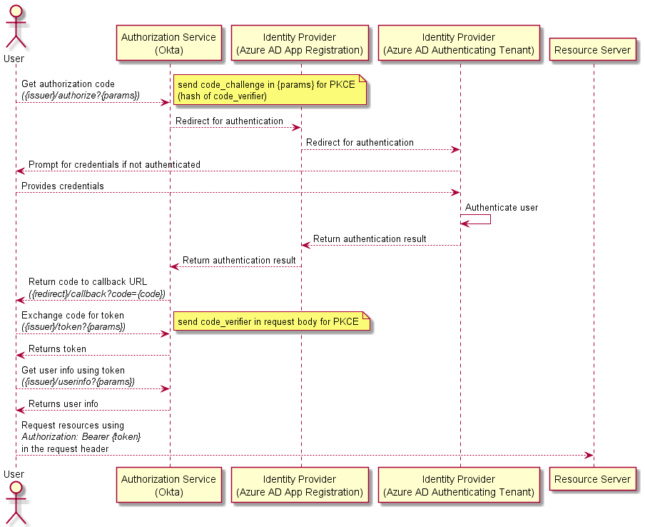

import Gist from 'react-gist';

This article demonstrates a simple command line utility to login to an authorization server (Okta in this case) using a PKCE (Proof Key for Code Exchange) flow.  This is the preferred flow for public clients (such as Single Page Applications).  

> The code for this article is available on [__GitHub__](https://github.com/stackql/okta-pkce-login)

## Example

## Overview

This application can be used to illustrate the authorization/authentication flow discussed in [Simple SSO with an external IdP using Active Directory and Okta](https://fullstackchronicles.io/simple-sso-with-an-external-idp-using-active-directory-and-okta).  A flow which is pictured here:  

## Steps

The steps involved in the implementation of a PKCE login flow are as follows:

### Generate a `code_challenge`

To implement a PKCE flow, you first need to generate a *Code Verifier* (which is a random value you create), the *Code Verifier* is then hashed using a SHA256 algorithm.  The hash is then used as the *Code Challenge*.  An example function to generate a code challenge is shown below:  
 
<Gist id="9a2a162813d77b83821d821b6a4a390a" 
/>

For more information see [Use PKCE to Make Your Apps More Secure](https://developer.okta.com/blog/2019/08/22/okta-authjs-pkce#:~:text=PKCE%20works%20by%20having%20the,is%20called%20the%20Code%20Challenge). 

### Build the `authorize` url

The `authorize` url is used to initiate the authorization flow with the authorization server.  An example function to construct the `authorize` url is shown below:  

<Gist id="9e628b905a532e5bd59f022a4adca340" 
/>

### Get the authorization code via redirect uri

The `redirecturi` parameter supplied in the `authorize` url is used to retrieve the authorization code from the authorization server.  In order to get this code using a front end flow, you need to define a handler that will get the authorization code, call the token endpoint, and close the HTTP server, as shown here:  

<Gist id="617417bdcc54efcea9d37d27228f7f2a" 
/>

### Exchange the code for an access token

The access token is what you ultimatly want, as this is the token that will be used to access protected resources.  An example function to exchange the authorization code for an access token is shown below:  

<Gist id="0a990674d8bde2baffc0b0231f52ed52" 
/>

### (Optional) Get the user profile

The access token can be used to get the user profile, this is done by calling the `userinfo` endpoint using the token.  An example function to get the user profile is shown below:  

<Gist id="f04e8b018417a73986d3696c58f735cb" 
/>

## with inspiration from...

- [Auth0 PKCE flow for a CLI built in golang](https://gist.github.com/ogazitt/f749dad9cca8d0ac6607f93a42adf322)
- [Golang sample for a CLI obtaining an access token using the PKCE flow](https://community.auth0.com/t/golang-sample-for-a-cli-obtaining-an-access-token-using-the-pkce-flow/40922)
- [oktadev/okta-node-cli-example](https://github.com/oktadev/okta-node-cli-example)
- [Build a Command Line Application with Node.js](https://developer.okta.com/blog/2019/06/18/command-line-app-with-nodejs)
- [About the Authorization Code grant with PKCE](https://developer.okta.com/docs/guides/implement-grant-type/authcodepkce/main/#about-the-authorization-code-grant-with-pkce)
