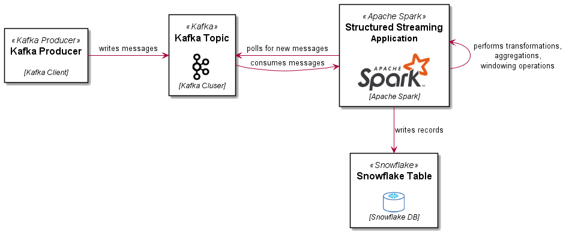
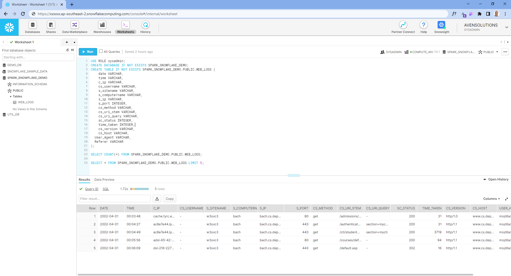

Structured Streaming in Spark provides a powerful framework for stream processing an analysis, such as streaming transformations, stateful streaming or sliding window operations.  

Kafka is a common streaming source and sink for Spark Streaming and Structured Streaming operations.  However, there may be situations where a data warehouse (such as Snowflake) is a more appropriate target for streaming operations, especially where there is a reporting or long-term storage requirement on the data derived from the streaming source.  

This article will demonstrate just how easy this is to implement using Python.  

## Design

The following diagram illustrates the ingestion design for this example:  

[](images/spark-streaming-kafka-snowflake.png)

## Snowflake Setup

Some prerequisites for Snowflake:  

1.	You will need to create a user (or use an existing user), in either case the user will need to be identified by a private key.  You will need to generate a key pair as follows:  

```bash
openssl genrsa 2048 | openssl pkcs8 -topk8 -inform PEM -out rsa_key.p8 -nocrypt
openssl rsa -in rsa_key.p8 -pubout -out rsa_key.pub
```
copy the contents of the `rsa_key.pub` file, remove the `-----BEGIN PUBLIC KEY-----` and `-----END PUBLIC KEY-----` strings, then remove the line breaks to form one string, use this string as the `RSA_PUBLIC_KEY` in a `CREATE USER` or `ALTER USER` statement in Snowflake, like:  

```sql
ALTER USER youruser SET RSA_PUBLIC_KEY='MIIBI...';
```

2.  Now setup the target database, schema and table you will use to write out your stream data (the schema for the table must match the schema for the Data Stream you will use the `DataStreamWriter` to emit records to Snowflake  

The user you will be using (that you setup the key pair authentication for) will need to be assigned a default role to which the appropriate write permissions are granted to the target objects in Snowflake.  You will also need to designate a virtual warehouse (which your user must have `USAGE` permissions to.  

## The Code

Now that we have the objects and user setup in Snowflake, we can construct our Spark application.  

First, you will need to start your Spark session (either using `pyspark` or `spark-submit`) including the packages that Spark will need to connect to Kafka and to Snowflake.  

The Snowflake packages include a JDBC driver and the Snowflake Connector for Spark, see [Snowflake Connector for Spark](https://docs.snowflake.com/en/user-guide/spark-connector.html).  

An example is shown here (package versions may vary depending upon the version of Spark you are using):  

```bash
pyspark \
--packages \
net.snowflake:snowflake-jdbc:3.13.14,\
net.snowflake:spark-snowflake_2.12:2.10.0-spark_3.1,\
org.apache.spark:spark-sql-kafka-0-10_2.12:3.2.1
```

Now that we have a spark session with the necessary packages, lets go...  

```python
# import any required functions, set the checkpoint directory, and log level (optional)
from pyspark.sql.functions import split
spark.sparkContext.setLogLevel("ERROR")
spark.conf.set("spark.sql.streaming.checkpointLocation", "file:///tmp")
```

setup connection options for Snowflake by creating an `sfOptions` dictionary  

```python
sfOptions = {
	  "sfURL" : sfUrl,
	  "sfUser" : "avensolutions",
	  "pem_private_key": private_key,
	  "sfDatabase" : "SPARK_SNOWFLAKE_DEMO",
	  "sfSchema" : "PUBLIC",
	  "sfWarehouse" : "COMPUTE_WH",
	  "streaming_stage" : "mystage"
}
```

set a variable for the Snowflake Spark connector  

```python
SNOWFLAKE_SOURCE_NAME = "net.snowflake.spark.snowflake"
```

read messages from Kafka:    

```python
lines = spark \
  .readStream \
  .format("kafka") \
  .option("kafka.bootstrap.servers", "kafkabroker:9092") \
  .option("subscribe", "weblogs") \
  .load()
```

perform necessary transformations (the fields and data types in the resultant data structure must match the target table you created in Snowflake:  

```python
log_recs = lines.select(
    split(lines.value.cast("string"), " ").alias("data")
    )
    
log_data = log_recs.selectExpr(
  "CAST(data[0] as string) as date",
  "CAST(data[1] as string) as time",
  "CAST(data[2] as string) as c_ip",  
  "CAST(data[3] as string) as cs_username",
  "CAST(data[4] as string) as s_sitename",  
  "CAST(data[5] as string) as s_computername",
  "CAST(data[6] as string) as s_ip",    
  "CAST(data[7] as int) as s_port",  
  "CAST(data[8] as string) as cs_method",    
  "CAST(data[9] as string) as cs_uri_stem",  
  "CAST(data[10] as string) as cs_uri_query",  
  "CAST(data[11] as int) as sc_status",
  "CAST(data[12] as int) as time_taken",    
  "CAST(data[13] as string) as cs_version",    
  "CAST(data[14] as string) as cs_host",
  "CAST(data[15] as string) as User_Agent",
  "CAST(data[16] as string) as Referer",    
)
```

write to Snowflake!  

```python
query = log_data\
	.writeStream\
	.format(SNOWFLAKE_SOURCE_NAME) \
	.options(**sfOptions) \
	.option("dbtable", "WEB_LOGS") \
	.trigger(processingTime='30 seconds') \
	.start()
	
query.awaitTermination()
```

:::info

Note that I have included the `processingTime` trigger of `30 seconds` (this is akin to the `batchInterval` in the DStream API), you should tune this to get a balance between batch sizes to ingest into Snowflake (which will benefit from larger batches) and latency.

:::

## The Results

[](images/snowflake-screenshot.png)

Enjoy!  