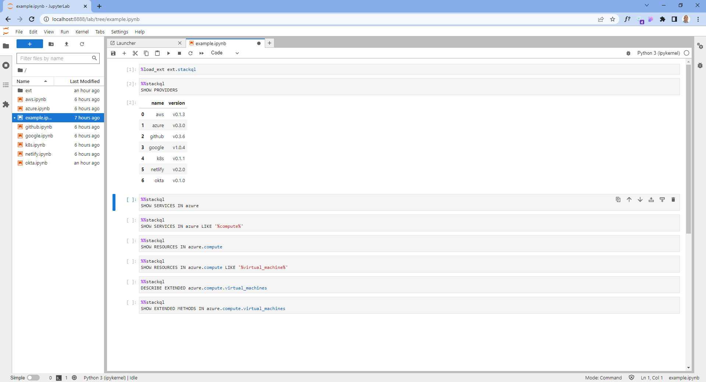

We were looking to implement a variant of the `%sql` magic command in Jupyter without using the default `sqlalchemy` module (in our case, just using `psycopg2` to connect to a local server - a StackQL postrges wire protocol server).  

## Create the extension module

We named our extension and cell magic command `stackql`, so start by creating a file named `stackql.py`.  We made this file in a directory name `ext` in the Jupyter working directory.    

## Write the magic extension

Magic commands can be __line-based__ or __cell-based__ or __line-or-cell-based__; in this example, we will use line-or-cell-based magic, meaning the decorator `%stackql` will be used to evaluate a line of code and the `%%stackql` decorator will be used to evaluate the entire contents of the cell it is used in.    

The bare-bones class and function definitions required for this extension are described below:  

### Create a Magic Class

We will need to define a **magics class**, which we will use to define the magic commands.  The class name is arbitrary, but it must be a subclass of `IPython.core.magic.Magics`.  An example is below:  

```python
from IPython.core.magic import (Magics, magics_class, line_cell_magic)

@magics_class
class StackqlMagic(Magics):

    @line_cell_magic
    def stackql(self, line, cell=None):
        if cell is None:
            # do something with line
        else:
            # do something with cell
        return results
```

### Load and register the extension

To register the magic functions in the `StackqlMagic` class we created above, use a function named `load_ipython_extension`, like the following:  

```python
def load_ipython_extension(ipython):
    ipython.register_magics(StackqlMagic)
```

### Complete extension code

The complete code for our extension is shown here:  

```python
from __future__ import print_function
import pandas as pd
import psycopg2, json
from psycopg2.extras import RealDictCursor
from IPython.core.magic import (Magics, magics_class, line_cell_magic)
from io import StringIO
from string import Template

conn = psycopg2.connect("dbname=stackql user=stackql host=localhost port=5444")

@magics_class
class StackqlMagic(Magics):

    def get_rendered_query(self, data):
        t = Template(StringIO(data).read())
        rendered = t.substitute(self.shell.user_ns)
        return rendered

    def run_query(self, query):
        cur = conn.cursor(cursor_factory=RealDictCursor)
        cur.execute(query)
        rows = cur.fetchall()
        cur.close()
        return pd.read_json(json.dumps(rows))

    @line_cell_magic
    def stackql(self, line, cell=None):
        if cell is None:
            results = self.run_query(self.get_rendered_query(line))
        else:
            results = self.run_query(self.get_rendered_query(cell))
        return results            

def load_ipython_extension(ipython):
    ipython.register_magics(StackqlMagic)
```

## Load the magic extension

To use our extension, we need to use the `%load_ext magic` command referencing the extension we created.  

```python
%load_ext ext.stackql
```
Note that since our extension was a file named `stackql.py` in a directory named `ext` we reference it using `ext.stackql`.   

## Use the magic function in a cell

To use the magic function in a cell (operating on all contents of the cell), we use the `%%` decorator, like:

```python
%%stackql
SHOW SERVICES IN azure
```
## Use the magic function on a line

To use the magic function on a line, we use the `%` decorator, like:

```python
%stackql DESCRIBE aws.ec2.instances
```

:::tip Using Variable Expansion

In our example, we implemented variable expansion using the "batteries included" String templating capabilities in Python3.  This allows for variables to be set globally in our notebooks and then used in our queries.  For example, we can set a variable in a cell like:

```python
project = 'stackql-demo'
zone = 'australia-southeast1-a'
```

Then use those variables in our queries like:  

```python
%%stackql
SELECT status, count(*) as num_instances
FROM google.compute.instances
WHERE project = '$project' 
AND zone = '$zone'
GROUP BY status
```

:::

An example is shown here:  

[](images/custom-jupyter-magic-command.png)

The complete code can be found at [__stackql/stackql-jupyter-demo__](https://github.com/stackql/stackql-jupyter-demo).

> if you have enjoyed this post, please consider [__buying me a coffee ☕__](https://www.buymeacoffee.com/jeffreyaven) to help me keep writing!